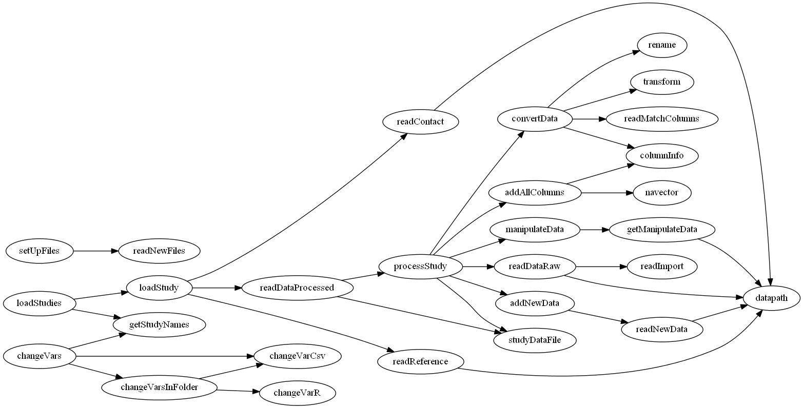

dataMashR
================

Daniel Falster, Remko Duursma, Rich FitzJohn, Diego Barneche

An R package for merging data from different studies in a transparent and reproducible fashion

For `dataMashR` developers:
* Manual pages are made with roxygen2. In Rstudio, make sure to set up automated
  roxygen compilation under `Build\Configure build tools...\Configure`.
* Do NOT edit the Rd files in /man manually. Ever.

Setup
----------------
The function `startDataMashR` defines location of various folders needed to run
dataMashR. If it hasn't already been run, this function is called from
`mashrDetail`, which is used to access elements of the setup.

If you want to deviate from default setup, you need to re-define `startDataMashR`
or run it with custom names, before running anything else in the dataMashR package.

Dependency graph
----------------

Data preparation
----------------

1. Each dataset is organised around a single publication and put into a folder with first-author and year, e.g. "Aiba2005". For unpublished data, data can be organised into a logical publishable unit and year set to 0000, e.g. "Aiba000".

2. The general principle when preparing data is to make as few (ideally none) changes as possible to the raw data file. Any transformations, unit changes, name changes etc can be done in the R import scripts. If you have an excel file, simply export it as a csv file.

3. Each folder requires the following files
	- `data.csv`: the raw data from the study
	- `dataImportOptions.csv`: specifies options for loading `data.csv` into R
	- `dataManipulate.r`: Can be left empty, this file contains any custom manipulations for the study. For example,
	- `dataMatchColumns.csv`: This table containing a list of columns in the original data file `data.csv`, plus any created in `dataManipulate.r`, in the column `var_in`, and the name of the variable in our database that it corresponds to in the `var_out` column. (See the `variableDefinitions.csv` file for a list of variables.) Variables which do not match anything in the database can be left blank. For any numeric variable (e.g. leaf mass), list the `units` of the raw data and the `method` used to measure it. Methods are recorded using a code. (See `methodsDefinitions.csv` for details.) Note also, all variable names are case sensitive. So if the original data has a column called `Species` you need to put `species` in the column `var_out`. Any variables created in `dataManipulate` file, must also be added into `dataMatchColumns`.
	- `dataNew.csv`: This table contains crucial information that doesn't exist in `data.csv`, e.g., latitude. If latitude is a non-existing columns in `data.csv`, than it can be entered in 'newVariable' with it's respective value in 'newValue'. Also note the source, i.e., where did the value come from and who entered it. If a value on applies to a subset of the data, this can be specified with `lookupVariable` and `lookupValue`. Eg. let's say that the published paper states that all individuals of "Genius speciei" were collected at a latitude of 10.5; this data could be entered using the following line
    species, exampleSpecies1, latitude, 10.5, from paper (D Falster).
	- `pdf-Aiba2005.pdf`:
	- `questions.txt`:
	- `studyContact.csv`: Who's responsible for the dataset? emailed, address?
	- `studyMetadata.txt`:
	- `studyRef.csv`: a single line with the full reference where the dataset comes from.

## Script to aid file preparation

Diego has written some functions to help create the above files.

1. First create a file `dataImportOptions.csv` for each new study using `makeDataImport(newStudyName)`

2. Then enter arguments in the `dataImportOptions.csv` files just created. Does the new data need to skip row, does it have a header?

3. Then make the remaining files: `setUpFiles(newStudyName)`

4. Fill in values for `dataMatchColumns.csv`, `dataManipulate.R`, `dataNew.csv`,  `studyContact.csv`, `questions.txt`, `StudyRef.csv`.

## Stages of import

0. File set-up incomplete (does not pass tests)
1. Data processed, but incomplete, or not verified by co-author
2. Report sent to co-author, issues outstanding
3. Finish data processing, verified by co-author, updated report sent.

